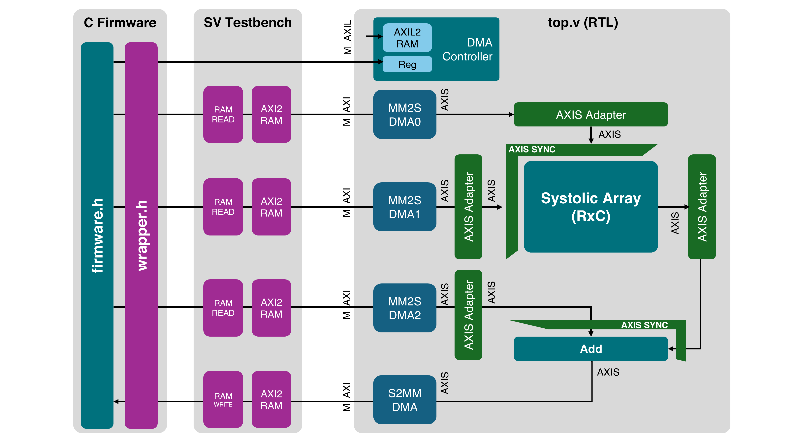
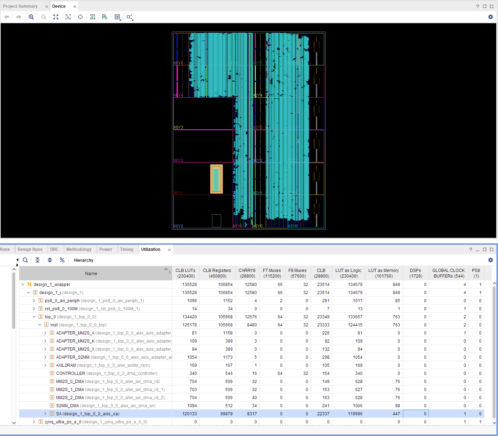

# AXI Stream Systolic Array

```
# Matrices:
k: (K,C) # Weights
x: (K,R) # Inputs
a: (C,R) # Partial sums
y: (C,R) # Outputs

The system performs:
y(C,R) = k.T(C,K) @ x(K,R) + a(C,R)
```



## Key files

* `run/golden.py` - Python reference that performs `y = k.T @ x + a`
* `run/sources.txt` - List of source files needed for simulation
* `tb/top_tb.sv` - Top testbench
* `rtl/sys/top.v` - Top RTL module with 4 M_AXI & one S_AXIL ports.
* `c/firmware.h` - Contains the basic firmware
* `rtl/sys/dma_controller.sv` - DMA controller that corresponds with firmware
* `rtl/sa/axis_sa.sv` - AXI Stream Systolic array

## To simulate the entire system:

### Verilator (Linux)

Add Verilator path (eg. `/tools/verilator/bin`) to `$PATH`
```
make veri
```

### Vivado Xsim (Linux)

Add Vivado path (eg. `/tools/Xilinx/Vivado/2022.2/bin`) to `$PATH`
```
make xsim
```

### Vivado Xsim (Windows)

First update `XIL_PATH` in `run/xsim.bat`, then run these in powershell
```
cd run
./xsim.bat
```

## Resources & Performance

Following was done on ZCU104. 
```
R=32,
C=32,
AXI_WIDTH=128
WK=8
WX=8
WA=32
WY=32
FREQ=100MHz
```


